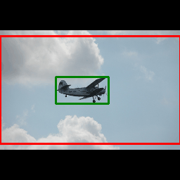

# ObjectDetectionRL
This repo contains the final project for our Reinforcement Learning course. The project contains an object detection
framework using deep reinforcement learning agents. The core model is a DQN
whose actions transform a bounding box until it tightly bounds the desired object.
The code is inspired by this [work](https://github.com/rayansamy/Active-Object-Localization-Deep-Reinforcement-Learning).

## Setup

Create a new conda environment and download all the required packages using the following line

`conda env create --file=environment.yml`

To use an existing conda environment and simply update its packages for this repo, run

`conda env update -name <MYENV> --file environment.yml --prune`

Please note that this package installs cudatoolkit version 11.1, which may not be compatible with your GPU drivers.

## Data 

Download the data by running the `prep_dataset.sh` script provided
in the util folder. Run the script as follows

`cd util`

`bash prep_dataset.sh <FOLDER_TO_STORE_DATA>`

## Using the Package

To use to package for training or visualization, refer to the scripts in `scripts_shuhao/local`.

## Example outputs

Here are some examples; note that the pretrained model seems to produce the best bounding boxes, so these examples are mainly
from the pretrained DQN. 

 

 
